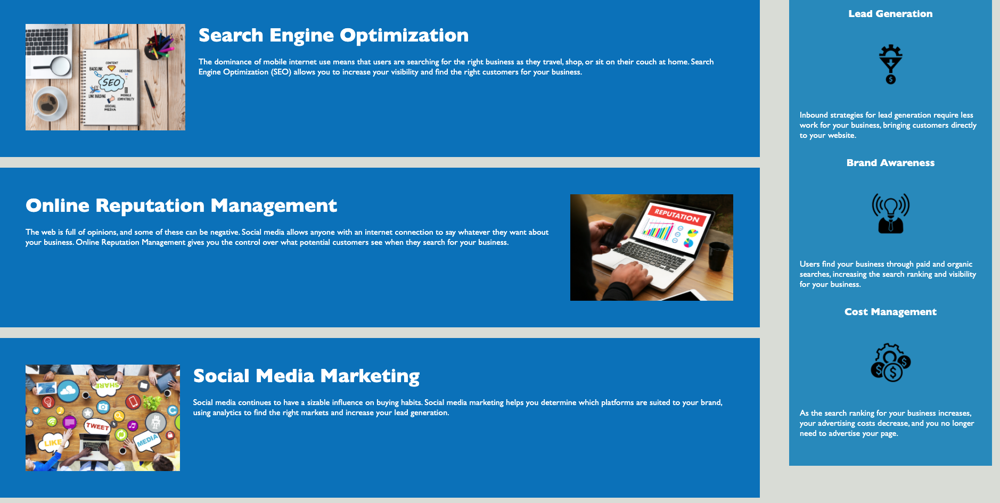

dubootcampHWOne

Changes in index.html:
1. Changed lines 11 and 31 from div to header, added nav tag on lines 16 and 29 to reflect the links within
2. Changed lines 34 and 57 from div to section
3. Changed lines 59 and 82 from div to aside
4. Changed lines 84 and 90 from tiv to footer
5. Changed line 33 from div to figure
6. Revised change 2, made that a main tag instead of section
7. Changed the div tags inside of the new main tag to be sections
8. Added appropriate alt tags to images on lines 39 49 and 59
9. Added appropriate alt tags to images on lines 73 81 and 89
10. Changed the div tags inside of the new aside tag to be sections
11. Added the title of Horiseon
12. Added working links to lines 20-30

Changes made in style.css:
1. Moved selectors and properties to follow semantic structure
2. Added some comments to CSS to clean it up

Link:
https://tmessall.github.io/dubootcampHWOne/

Screenshots:

